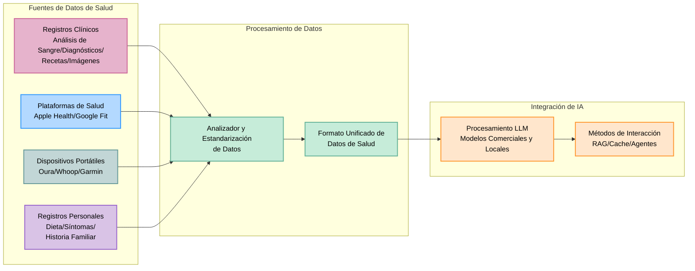

# 🚀 **OpenHealth**

**Asistente de Salud con IA | Impulsado por tus datos**

<div align="center">

<p align="center">
  
  
  
</p>

> **📢 ¡Ahora Disponible en Versión Web!**  
> Hemos hecho OpenHealth más accesible con dos opciones adaptadas:  
> **[Clínica](https://qna.open-health.me/)** - Consultas de salud rápidas y sencillas  
> **[Plataforma Completa](https://www.open-health.me/)** - Herramientas avanzadas para una gestión integral de la salud

### 🌍 Elija su Idioma
[English](../../README.md) | [Français](README.fr.md) | [Deutsch](README.de.md) | [Español](README.es.md) | [한국어](README.ko.md) | [中文](README.zh.md) | [日本語](README.ja.md) | [Українська](README.uk.md)

</div>

---

<p align="center">
  
</p>

## 🌟 Descripción General

> OpenHealth le ayuda a **tomar el control de sus datos de salud**. Aprovechando la IA y su información personal de salud,
> OpenHealth proporciona un asistente privado que le ayuda a comprender y gestionar mejor su salud. Puede ejecutarlo completamente de forma local para máxima privacidad.

## ✨ Características del Proyecto

<details open>
<summary><b>Funcionalidades Principales</b></summary>

- 📊 **Entrada Centralizada de Datos de Salud:** Consolide fácilmente todos sus datos de salud en un solo lugar.
- 🛠️ **Análisis Inteligente:** Analiza automáticamente sus datos de salud y genera archivos de datos estructurados.
- 🤝 **Conversaciones Contextuales:** Utilice los datos estructurados como contexto para interacciones personalizadas con IA impulsada por GPT.

</details>

## 📥 Fuentes de Datos y Modelos de Lenguaje Compatibles

<table>
  <tr>
    <th>Fuentes de Datos Disponibles</th>
    <th>Modelos de Lenguaje Compatibles</th>
  </tr>
  <tr>
    <td>
      • Resultados de Análisis de Sangre<br>
      • Datos de Chequeo Médico<br>
      • Información Física Personal<br>
      • Historial Familiar<br>
      • Síntomas
    </td>
    <td>
      • LLaMA<br>
      • DeepSeek-V3<br>
      • GPT<br>
      • Claude<br>
      • Gemini
    </td>
  </tr>
</table>

## 🤔 Por Qué Creamos OpenHealth

> - 💡 **Su salud es su responsabilidad.**
> - ✅ La verdadera gestión de la salud combina **sus datos** + **inteligencia**, convirtiendo las percepciones en planes accionables.
> - 🧠 La IA actúa como una herramienta imparcial para guiarlo y apoyarlo en la gestión efectiva de su salud a largo plazo.

## 🗺️ Diagrama del Proyecto





Entrada de datos de salud --> Módulo de análisis --> Archivos de datos estructurados --> Integración GPT

> **Nota:** La funcionalidad de análisis de datos está actualmente implementada en un servidor Python separado y está planificada su migración a TypeScript en el futuro.

## Comenzando

## ⚙️ Cómo ejecutar OpenHealth

1. **Clonar el repositorio:**
   ```bash
   git clone https://github.com/OpenHealthForAll/open-health.git
   cd open-health
   ```

2. **Configuración y Ejecución:**
   ```bash
   # Copiar el archivo de entorno
   cp .env.example .env

   # Iniciar la aplicación con Docker Compose
   docker compose --env-file .env up
   ```

   Para usuarios existentes:
   ```bash
   # Generar ENCRYPTION_KEY para el archivo .env:
   # Ejecute el siguiente comando y agregue la salida a ENCRYPTION_KEY en .env
   echo $(head -c 32 /dev/urandom | base64)

   # Reconstruir e iniciar la aplicación
   docker compose --env-file .env up --build
   ```

3. **Acceder a OpenHealth:**
   Abra su navegador y vaya a `http://localhost:3000` para comenzar a usar OpenHealth.

> **Nota:** El sistema consta de dos componentes principales: análisis y LLM. Para el análisis, puede usar docling para una ejecución completamente local, mientras que el componente LLM puede ejecutarse completamente de forma local usando Ollama.

> **Nota:** Si está usando Ollama con Docker, asegúrese de configurar el punto final de la API de Ollama como: `http://docker.for.mac.localhost:11434` para Mac o `http://host.docker.internal:11434` para Windows.

## 🌐 Comunidad y Soporte

<div align="center">

### 💫 Comparte tu Historia y Mantente Actualizado
[](https://www.reddit.com/r/AIDoctor/)
[](https://discord.gg/B9K654g4wf)

### 🤝 Habla con el Equipo
[](https://calendly.com/open-health/30min)
[](mailto:sj@open-health.me)

</div>

---
